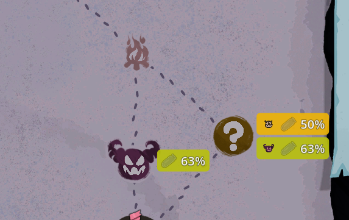

# StS2 Potion Drop Chance

**Slay the Spire 2** 맵 화면에서 진입 가능한 전투 노드 옆에 **포션 드롭 확률**을 색상 배지로 직접 표시하는 모드입니다.

> "방금 운이 나빴던 건가, pity가 낮은 건가?" 더 이상 추측하지 마세요 — 진로 결정 전에 실제 숫자를 보여드립니다.



*좌하단: 일반 전투 노드에 `[포션] 63%` (라임). 우측: Unknown(`?`) 노드는 두 배지가 쌓여 있음 — `[몬스터][포션] 50%` (노랑) 위, `[엘리트][포션] 63%` (라임) 아래, 가정별 하나씩.*

[English README](README.md)

---

## 기능

- **노드별 확률 배지** — 다음에 진입할 수 있는 일반 / 엘리트 / Unknown(`?`) 노드마다 표시
- **Pity 카운터 반영** — 게임 내 `PotionRewardOdds.Roll()` 과 동일한 수식: 베이스 40%, 드롭/미드롭마다 ±10%
- **엘리트 보너스 포함** — 엘리트는 `pity + 12.5%` 로 표시 (`Roll()` 의 effective bonus 그대로)
- **Unknown 노드** 는 조건부 확률 — `M:50%` 은 *몬스터로 결정될 경우 드롭 확률 50%* 라는 의미
- **유물 인식**: White Beast Statue → 100% (전투 노드 전체), Sozu → 0% (procurement 차단)
- **색상 스케일** 빨강 → 주황 → 노랑 → 라임 → 청록 — 숫자 안 봐도 한눈에 파악 가능
- **진입 가능한 노드만** — 지도 전체가 아닌, *바로 다음에 갈 수 있는* 노드에만 배지가 뜸
- **로컬 + 읽기 전용** — 게임 상태 수정 없음, 네트워크 동기화 없음, 다른 플레이어에 영향 0
- 매니페스트에 `"affects_gameplay": false` 표기 — 멀티플레이 중에도 안전
- **선택적 ModConfig 지원** — [ModConfig](https://www.nexusmods.com/slaythespire2/mods/27) 가 설치되어 있으면 게임 설정의 `Mods` 탭에서 다음 옵션이 노출됩니다 (변경 즉시 반영):
  - *Hide on ? (Unknown) nodes* — Unknown 노드 배지 숨기기
  - *Badge position* — 배지 표시 위치 선택 (Right / Left / Above / Below)
  - ModConfig 미설치 환경에서도 모드는 정상 작동 (토글 UI 만 숨김)

## 작동 방식

1. `MegaCrit.Sts2.Core.Nodes.Screens.Map.NMapPoint.RefreshVisualsInstantly` 와 `NNormalMapPoint._Ready` 에 Harmony 패치를 적용합니다.
2. 시각 갱신 시점마다 노드 상태가 `Travelable` 이고 일반 / 엘리트 / Unknown 인지 확인합니다.
3. 조건이 맞으면 로컬 플레이어의 포션 드롭 확률을 `PotionRewardOdds.Roll()` 과 동일한 수식으로 계산:
   - `player.PlayerOdds.PotionReward.CurrentValue` (pity 카운터) 읽기
   - 엘리트는 `+0.125` 가산
   - `Hook.ShouldForcePotionReward(...)` 호출 → 강제 유물(White Beast Statue 등)이 있으면 100%
   - `player.Relics` 에서 Sozu 검사 → 발견 시 0%
4. 맵 노드의 자식으로 `PanelContainer` + `Label` 을 추가하고 배경색을 확률에 따라 칠합니다.

`Roll()` 자체는 절대 호출하지 않습니다 — 게임이 보는 입력만 읽습니다.

## 색상 스케일

| 확률 | 색 |
|---|---|
| 0% | 빨강 `#dc2626` |
| 25% | 주황 `#f97316` |
| 50% | 노랑 `#eab308` |
| 75% | 라임 `#84cc16` |
| 100% | 청록 `#0d9488` |

인접 stop 사이는 선형 보간. 100% 는 연두/라임과 시각적으로 구분되도록 일부러 cool teal-green 으로 두었습니다.

## 멀티플레이

완전한 클라이언트 사이드 모드입니다.

- DLL 은 본인 클라이언트에만 로드 — 다른 플레이어는 변경 없는 게임을 봅니다.
- `LocalContext.GetMe(...)` 로 표시되는 odds 를 *본인의* `PlayerOdds.PotionReward.CurrentValue` 에 한정 — 상대 pity 는 절대 보이지 않습니다.
- 네트워크 메시지 없음, 공유 상태에 쓰기 없음 — 순수한 UI 오버레이입니다.

## 설치

1. [GitHub Releases](../../releases) 에서 최신 `Sts2PotionDropChance-vX.Y.Z.zip` 다운로드.
2. `Sts2PotionDropChance.dll` 과 `Sts2PotionDropChance.json` 을 다음 경로에 풀어넣기:
   ```
   <Slay the Spire 2 설치 폴더>/mods/Sts2PotionDropChance/
   ```
3. 게임 실행.

## 소스에서 빌드

요구사항:
- .NET SDK 9.0
- Godot.NET.Sdk 4.5.1 (자동 해결)
- 로컬에 설치된 Slay the Spire 2 (`Sts2PathDiscovery.props` 가 Steam 레지스트리 / 표준 경로에서 자동 탐지)

```sh
dotnet build Sts2PotionDropChance.csproj -c Release
```

빌드 시 자동으로 `Sts2PotionDropChance.dll` 과 `Sts2PotionDropChance.json` 이 `<sts2>/mods/Sts2PotionDropChance/` 로 복사됩니다.

## 설정

게임 실행 전 환경 변수 `STS2_POTION_DROP_CHANCE_DISABLED=1` 을 설정하면 모드를 제거하지 않고도 모든 배지를 숨길 수 있습니다.

## 한계 / 주의

- **보스 노드는 의도적으로 표시 안 함** — 어차피 고정 진로라 결정에 영향이 없기 때문.
- **Unknown(`?`) 노드** 는 "몬스터로 결정될 경우" 의 조건부 확률만 표시. 실제 포션 롤은 전투방으로 결정될 때만 의미 있습니다 (Treasure / Shop / Event 는 포션 안 줌).
- 표시되는 확률은 **지금 전투가 끝난다면 굴려질 값** 입니다. 이후 전투마다 pity 가 ±10% 씩 변동하며, 상태 갱신 시 배지가 자동 업데이트됩니다.
- 모드는 `PotionRewardOdds.Roll()` 자체에 패치하지 않습니다 — 입력만 읽을 뿐. MegaCrit 가 향후 패치에서 수식을 바꾸면 이 모드의 표시가 부정확해질 수 있으니, 그때는 소스부터 갱신해야 합니다.

## 크레딧

- **MegaCrit** — Slay the Spire 2 본 게임.
- **HarmonyX** — 런타임 패칭 라이브러리 (게임에 번들로 포함, 본 모드는 재배포하지 않음).

## 라이선스

[MIT](LICENSE).
